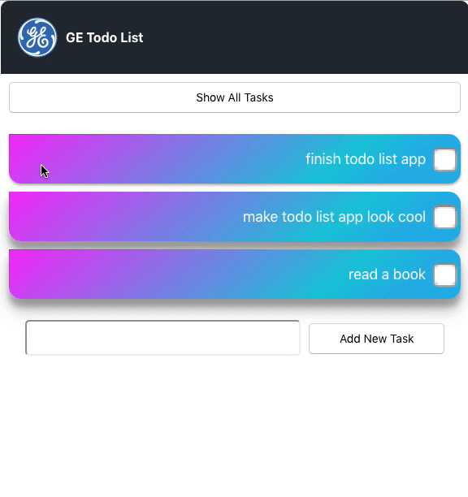

# Todo List App
### Built with React

[Download Source code](https://github.com/nbkm8y5/todolistreact/archive/v0.1.0-alpha.zip)

open terminal in Mac or Linux environment

Type:

```
unzip todolistreact.zip

cd todolistreact

npm start
```

Windows environment in powershell

```
unzip todolistreact.zip

cd todolistreact

npm start
```

Note: please have node installed in your computer and git

Additional features:

Create New tasks
View All Tasks
Mark/Unmark Completed Tasks
Drag and drop to delete tasks


